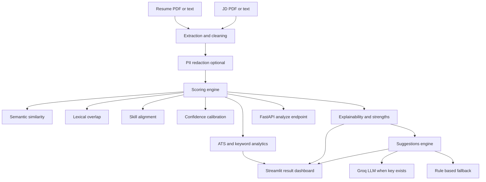
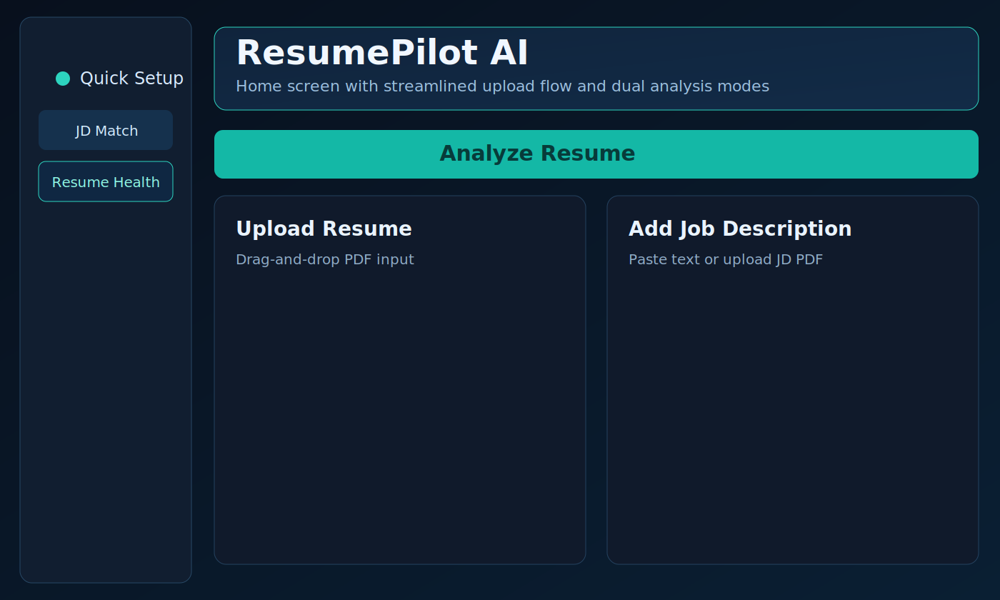
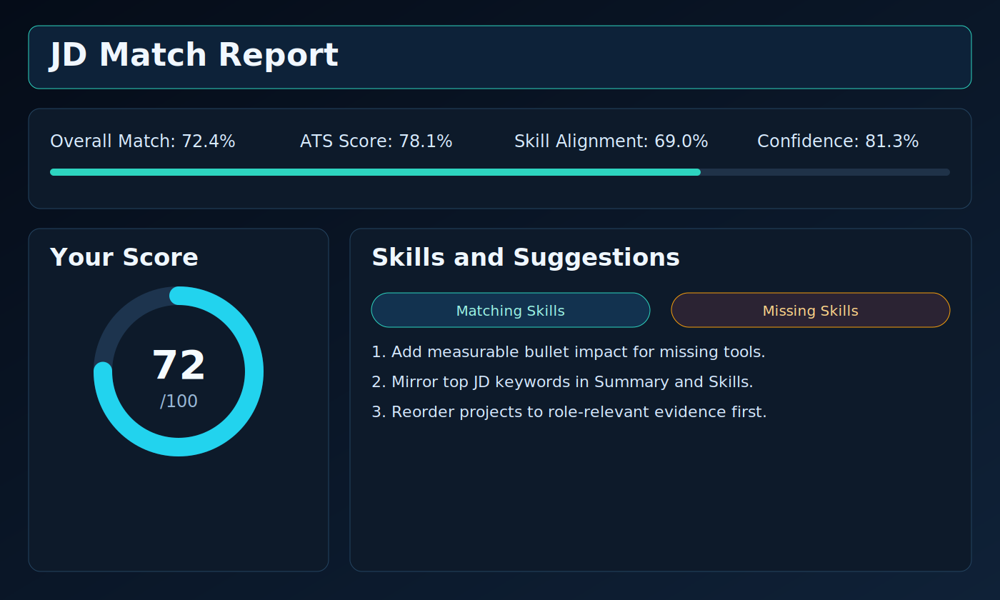
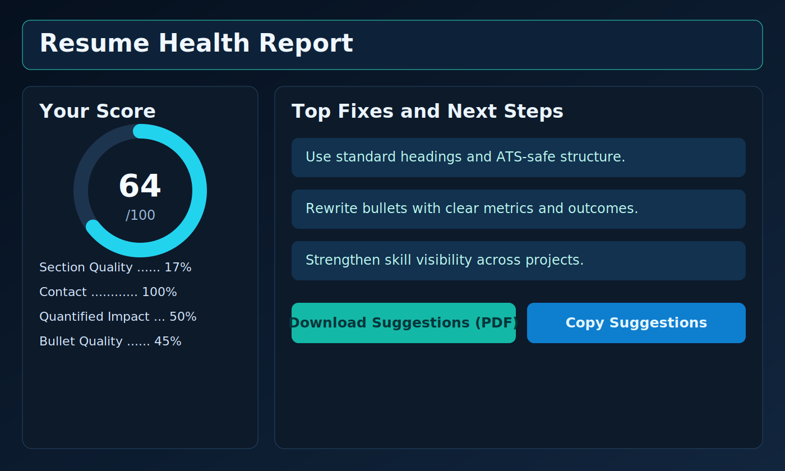

# ResumePilot AI

AI-powered resume intelligence app with two practical modes:
- `JD Match` mode for resume-vs-job fit scoring
- `Resume Health` mode for standalone resume quality scoring and fixes

It is production-ready for portfolio use with Streamlit UI, FastAPI backend, CI tests, evaluation artifacts, Docker support, and Hugging Face auto-deploy.

## Live Links
- Hugging Face Space: https://huggingface.co/spaces/shinzobolte/ai-resume-screener-job-matcher
- GitHub Repository: https://github.com/shinzoxD/ai-resume-screener-job-matcher

## Problem
Recruiters and candidates waste time on manual resume screening because most tools are either:
- keyword-only and shallow,
- hard to explain,
- not ATS-aware,
- or not actionable for resume improvement.

## Solution
ResumePilot AI solves this with a clear, auditable workflow:
1. Extract text from resume and JD PDFs/text.
2. Compute hybrid match scores (semantic + lexical + skill alignment).
3. Show matched/missing skills and ATS indicators.
4. Generate concrete improvement suggestions (LLM when configured, rule-based fallback otherwise).
5. Provide downloadable outputs for next-step resume edits.

## Product Modes
1. `JD Match`
- Inputs: Resume + Job Description
- Outputs: Overall match, ATS score, skill alignment, confidence, missing skills, targeted suggestions

2. `Resume Health`
- Inputs: Resume only
- Outputs: Resume quality score, section quality, contact completeness, bullet quality, quantified impact, top fixes

## Key Features
- PDF/Text input support (resume and JD)
- Hybrid similarity scoring with `sentence-transformers` + cosine + lexical features
- Skill extraction with matching/missing skills view
- ATS compatibility scoring and keyword density checks
- Interactive score card UI with ring score and issue breakdown
- LLM suggestions via Groq (`GROQ_API_KEY`) with safe fallback to rule-based suggestions
- Batch screening mode
- FastAPI analyze endpoint for backend integration
- Download outputs (PDF/Markdown)
- CI-tested + Dockerized + Hugging Face auto-deploy

## Tech Stack
- UI: `streamlit`
- PDF parsing: `PyMuPDF (fitz)`
- Embeddings: `sentence-transformers` (`all-MiniLM-L6-v2`, `all-mpnet-base-v2`)
- ML metrics/utilities: `scikit-learn`, `numpy`, `scipy`, `pandas`
- Optional LLM: `groq` (Llama / Mixtral)
- Backend API: `fastapi` + `uvicorn`
- Testing: `pytest`
- Deployment: Docker + GitHub Actions + Hugging Face Spaces
- Python: `3.11+`

## Architecture


## UI Snapshots
No demo video included (as requested). Static UI snapshots are included below.

### Home and Mode Selection


### JD Match Report


### Resume Health Report


## Project Structure
```text
.
|-- app.py
|-- backend/
|   |-- __init__.py
|   |-- main.py
|   `-- schemas.py
|-- utils/
|   |-- extractor.py
|   |-- matcher.py
|   |-- llm_suggestions.py
|   |-- observability.py
|   |-- privacy.py
|   `-- skills_db.py
|-- data/
|   |-- app_history.db
|   `-- eval_pairs.jsonl
|-- scripts/
|   `-- evaluate.py
|-- tests/
|   |-- conftest.py
|   |-- test_api.py
|   |-- test_extractor.py
|   |-- test_matcher.py
|   |-- test_new_features.py
|   `-- test_privacy.py
|-- artifacts/
|   `-- eval_results.csv
|-- assets/
|   `-- screenshots/
|-- .github/workflows/
|   |-- ci.yml
|   `-- deploy-hf.yml
|-- .streamlit/config.toml
|-- requirements.txt
|-- pyproject.toml
|-- Dockerfile
|-- docker-compose.yml
|-- Makefile
`-- README.md
```

## Results
As of `March 2, 2026`, from local project artifacts and tests:

### Evaluation Metrics (`artifacts/eval_results.csv`, 10 labeled pairs)
- MAE: `16.711`
- RMSE: `19.320`
- Pearson correlation: `0.949`
- Spearman correlation: `0.818`

### Engineering Quality Metrics
- Test suite: `12 passed` (`pytest -q`)
- Python compile check: `app.py` compiles successfully
- CI pipelines included: unit tests + Hugging Face deploy workflow

## How to Run Locally
```bash
python -m venv .venv
.venv\Scripts\Activate.ps1
pip install --upgrade pip
pip install -r requirements.txt
streamlit run app.py
```

Optional API server:
```bash
uvicorn backend.main:app --reload --host 0.0.0.0 --port 8000
```

Run tests:
```bash
pytest -q
```

## Secrets and Fallback Behavior
### Local Streamlit (`.streamlit/secrets.toml`)
```toml
GROQ_API_KEY = "your_groq_key"
```

### Hugging Face Space Secrets
Add `GROQ_API_KEY` in Space Settings -> Variables and secrets.

### Behavior Without `GROQ_API_KEY`
- App still works fully.
- Suggestions automatically switch to rule-based mode.
- UI shows a warning/notice so users know LLM suggestions are disabled.

## Deployment
### Streamlit Community Cloud
1. Push this repo to GitHub.
2. Go to https://share.streamlit.io.
3. Select repo and `app.py` as entrypoint.
4. Add optional secret `GROQ_API_KEY`.

### GitHub -> Hugging Face Auto Deploy
This repo includes `.github/workflows/deploy-hf.yml`.

Required GitHub secrets:
- `HF_TOKEN` (write token)
- `HF_SPACE_REPO` in `owner/space-name` format

On push to `main`, workflow syncs repo to your Docker Space.

## Resume Bullets You Can Use
- Built and deployed `ResumePilot AI`, a dual-mode resume intelligence platform (JD Match + Resume Health) using Streamlit, FastAPI, PyMuPDF, and sentence-transformers, with ATS analytics and explainable scoring.
- Engineered a hybrid scoring pipeline combining semantic similarity, lexical overlap, and skill alignment with confidence calibration; achieved strong alignment to human labels (Pearson `0.949`, Spearman `0.818`) on evaluation pairs.
- Implemented production CI/CD with pytest-based quality gates and automated GitHub-to-Hugging-Face deployment, plus optional Groq LLM suggestions with resilient rule-based fallback.

## Future Improvements
1. Add role-specific score calibration datasets.
2. Add richer grammar/style checks for Resume Health mode.
3. Add recruiter workspace with persistent candidate comparison.
4. Add benchmark suite for multilingual and OCR-heavy resumes.
5. Add optional vector database for historical profile search.
